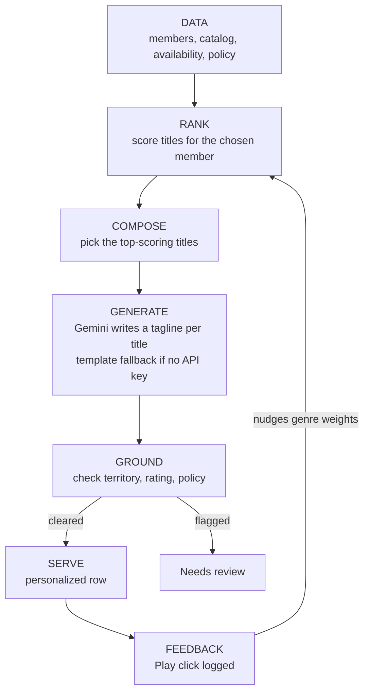

# CineMatch — Grounded Personalized Discovery (Classroom MVP)

A small, local prototype built for a 90-minute classroom exercise. It demonstrates,
end to end, how a streaming service could turn member data into a personalized,
governed home screen: rank titles for a member, write a tailored tagline, check
that each title is actually allowed to be shown, and learn from clicks — all on
one screen.

This is a teaching prototype, not production software. See [What's Real, Simplified, Mocked, and Postponed](#whats-real-simplified-mocked-and-postponed) below.

## Purpose

Streaming growth increasingly depends on retention, not new signups. Personalization
is the main lever on churn. CineMatch shows that lever in miniature: pick a member,
watch the app rank and compose a personalized row, generate a tailored tagline per
title, and clear or flag each one before it's shown — the "grounding before serving"
principle.

## Quick start

```bash
python3 -m venv venv
source venv/bin/activate        # Windows: venv\Scripts\activate
pip install -r requirements.txt
python generate_data.py          # one-time: writes the synthetic data/ files
streamlit run app.py
```

The app opens at `http://localhost:8501`. No API key or internet connection is
required — it runs fully offline with template-based taglines.

### Optional: enable live AI-generated taglines

Without a key, each tagline is a plain-text template ("A thriller pick made for
bingers fans like Ana."). With a Gemini API key, the same line is written live by
Gemini instead.

1. Get a key at [aistudio.google.com/apikey](https://aistudio.google.com/apikey)
2. Copy `.env.example` to a new file named `.env` (or edit the `.env` already in the project)
3. Set `GEMINI_API_KEY=your-key-here` inside it

`.env` is already git-ignored — never commit your key or paste it into code.

## Project structure

```
app.py             Streamlit UI — member selector, row, review area, feedback
logic.py           Deterministic logic: data loading, ranking, grounding, feedback
ai.py               Gemini API tagline + on-demand thumbnail calls, with fallbacks
generate_data.py   One-time generator for the synthetic /data files
data/               members.csv, catalog.csv, availability.csv, policy.txt
requirements.txt
.env.example        Template for your local .env (never commit the real key)
```

## How it works



1. **Select a member** — 8 fictional members, each with a segment, home territory,
   favorite genres, and a maturity ceiling.
2. **Rank** — a transparent weighted score (genre match + segment affinity +
   popularity, weights visible and adjustable on screen) orders all 33 fictional
   titles for that member.
3. **Compose** — the top-scoring titles become row candidates.
4. **Generate** — each candidate gets a short tagline (Gemini API, or a template if
   there's no key).
5. **Ground** — every candidate is checked against territory availability, the
   rights window, the member's maturity ceiling, and a short policy file (simple
   keyword lookup). Anything that fails is pulled into "Needs review" with a plain
   -language reason instead of being shown.
6. **Serve** — cleared titles fill the personalized row, each shown by default as a
   colored style card. Clicking **🎨 Generate art** on a card calls the Gemini image
   model live for an abstract, mood-matched illustration in its place (see note below).
7. **Feedback** — clicking ▶ Play on a title logs it and nudges that title's genres
   upward for the rest of the session, visibly reordering the row on the next look.
   This closes the loop back into step 2.

### About the AI-generated thumbnails

Thumbnails are colored style cards by default — generating art is opt-in per title
(click **🎨 Generate art**) because image generation is much slower than the text
taglines, and doing it automatically for a whole row would make the demo feel
sluggish. The prompt deliberately asks for **abstract shapes, gradients, and mood/color
only** — no text, no logos, no recognizable faces, no real actors or characters —
which keeps it a stylized illustration rather than anything that could resemble a
real movie poster (this is the same brand/IP concern the original spec flagged
for mocking thumbnails, just handled with a narrower, safer prompt instead of
skipping the feature entirely). Results are cached per title/member for the
session; if there's no key or the call fails, the style card stays as-is.

## Data

All data is synthetic and fictional, generated once by `generate_data.py`:

- **members.csv** — 8 members (id, name, segment, territory, favorite genres, maturity ceiling)
- **catalog.csv** — 33 titles (id, title, genres, maturity rating, popularity, card color)
- **availability.csv** — every title × 6 territories, with an `available` flag and a
  `rights_window_ok` flag (the mocked rights/availability service)
- **policy.txt** — 3 short editorial rules used for a keyword-lookup compliance check

A handful of titles were deliberately crafted so every member sees at least one
flagged title near the top of their ranked list (unavailable in their territory,
over their rating ceiling, a closed rights window, or a restricted genre tag) —
this guarantees the "Needs review" area has something to show no matter which
member you demo.

## What's Real, Simplified, Mocked, and Postponed

| | What it is here |
|---|---|
| **Real** | Ranking math, grounding checks (availability/rating/policy), the feedback loop, and (with an API key) the Gemini-generated taglines and on-demand thumbnails are all genuinely running code — not staged or hardcoded. |
| **Simplified** | Member segments are hand-labeled, not clustered. Ranking is an explainable weighted formula, not a trained model. The "RL" feedback loop is a greedy weight nudge, not real reinforcement learning. Policy lookup is a plain keyword scan over one text file, not semantic search over a real policy corpus. Churn/engagement figures shown are illustrative numbers derived from the profile, not predictions. |
| **Mocked** | Thumbnails default to colored style cards; AI art is opt-in and deliberately abstract (no faces/text/logos) rather than full GAN movie-poster generation — avoids IP risk and heavy infra. The rights/availability service is a static CSV, not a live rights system. The "conflict message" is a rule-based string, not a reasoning engine. |
| **Postponed** | Real GAN thumbnail generation, trained supervised/RL models, Graph-RAG/knowledge graphs, multi-territory scaling, live Netflix data or integrations, user authentication, and any cloud/container/CI infrastructure. All explicitly out of scope for a 90-minute build. |

## Assumptions & limitations

- Data is synthetic and small (8 members, 33 titles); results are illustrative, not statistically valid.
- Ranking and the feedback loop are transparent heuristics meant to demonstrate the
  data → decision → feedback loop, not to achieve production accuracy.
- Grounding uses a static availability table and a keyword policy lookup; a real
  system would need live rights data and semantic retrieval.
- The prototype does not attempt to prove that steering engagement actually lowers
  churn — that question stays open, as in the underlying strategy work.
- Generated artwork is abstract by design (no faces, text, logos, or likenesses) to avoid brand/IP risk — it is not attempting to recreate real movie poster art.

## Troubleshooting

- **`streamlit: command not found`** — activate the virtual environment first
  (`source venv/bin/activate`).
- **Blank taglines or a Gemini error message** — check that `.env` contains a valid
  `GEMINI_API_KEY`; the app should still run fine on the template fallback either way.
- **Port already in use** — run `streamlit run app.py --server.port 8502` instead.
